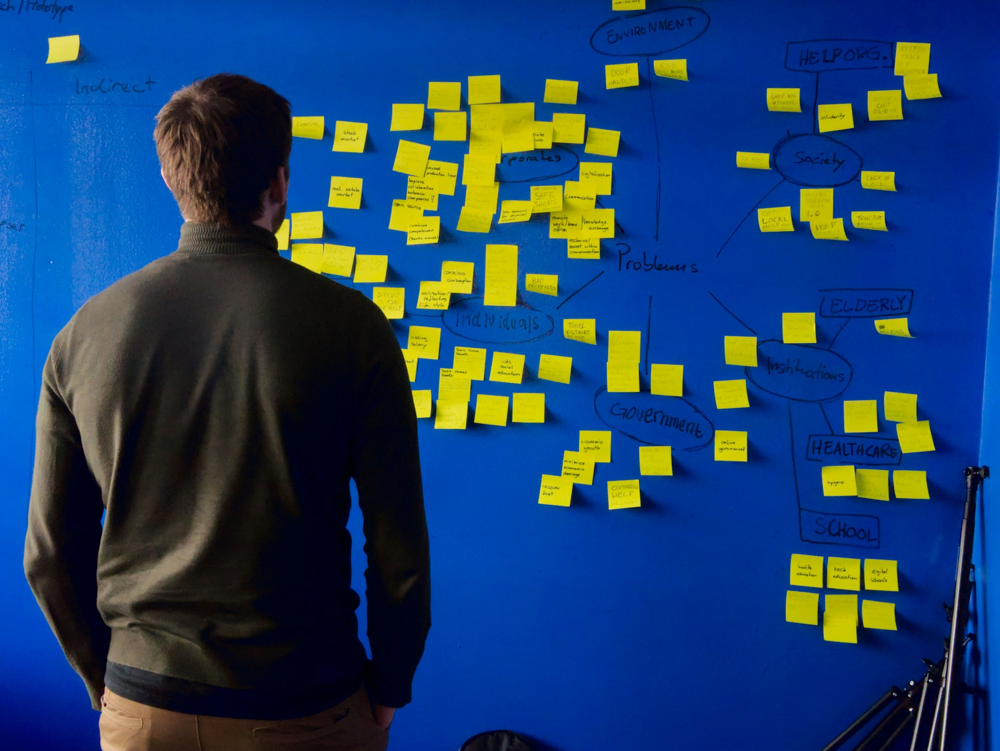
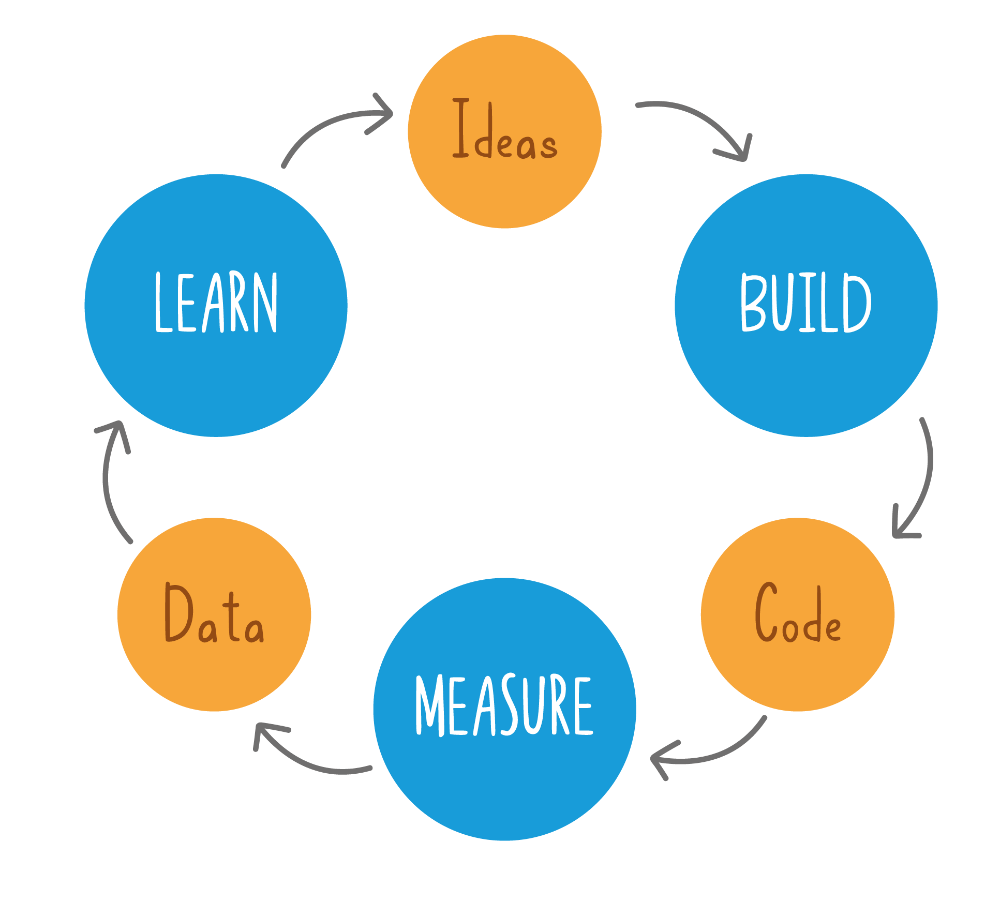
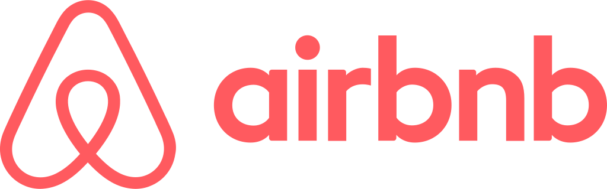
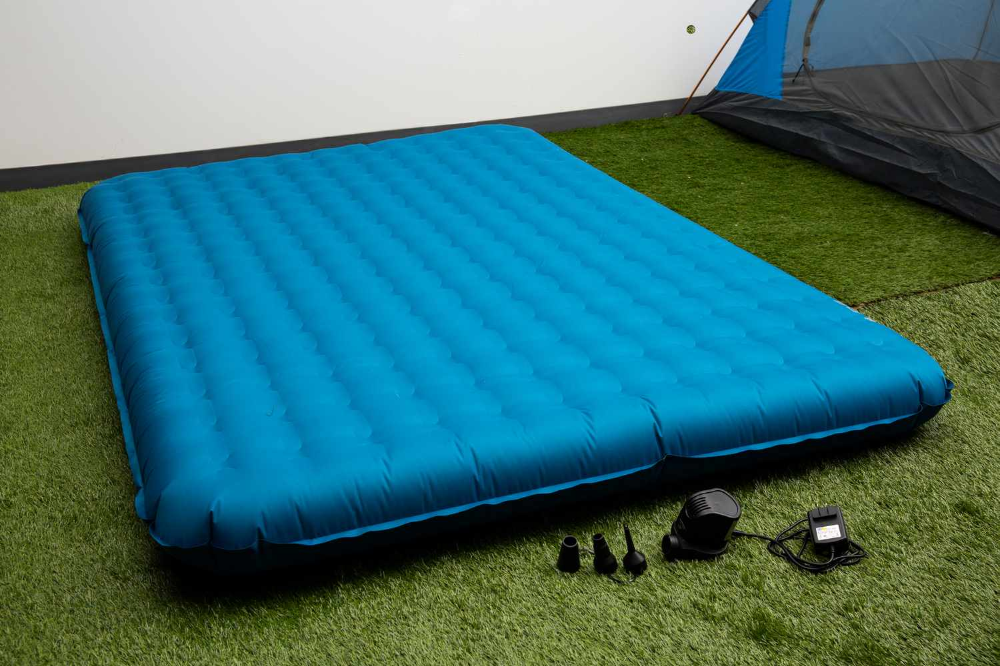

autoscale: false
footer: Nils Müller - Lean Startup
slidenumbers: true
theme: Scherzkeks, 7

# Let's talk about
# [fit] **Lean Startup**

---

# Woran denkst du

# beim Wort "Startup"?

---

---

---

---

---

# Was ist "Lean Startup"?

---

# 1 Typ

---

---

# 1 Problem

---

---

# 2 Ideen

---

Minimum Viable Product

---

Validated Learning

---

---

---

# [fit] Zeit für ein **Beispiel**!

---

---

---

---

# [fit] Quelle:
# [The Inside Story Behind the Unlikely Rise of Airbnb](https://knowledge.wharton.upenn.edu/podcast/knowledge-at-wharton-podcast/the-inside-story-behind-the-unlikely-rise-of-airbnb/)

---

# Wie setzen **wir** das um?

---

# 1.
# [fit] Identifiziere das Problem,
# [fit] das du lösen willst.

---

# 2.
# [fit] Formuliere deine Hypothese.

---

# 3.
# [fit] Baue ein MVP,
# [fit] um die Hypothese zu testen.

---

# 4.
# [fit] Sammle Daten und
# [fit] Kund\*innen-Feedback.

---

# 5.
# [fit] Verbessere das MVP
# [fit] anhand des Feedbacks.

---

# 6.
# [fit] Wiederhole den Zyklus
# [fit] bis alle zufrieden sind.

---

---

# [fit] Lasst uns klein starten.

---

# [fit] Hauptsache, wir starten! 🚀

---

# Vielen Dank 😌
